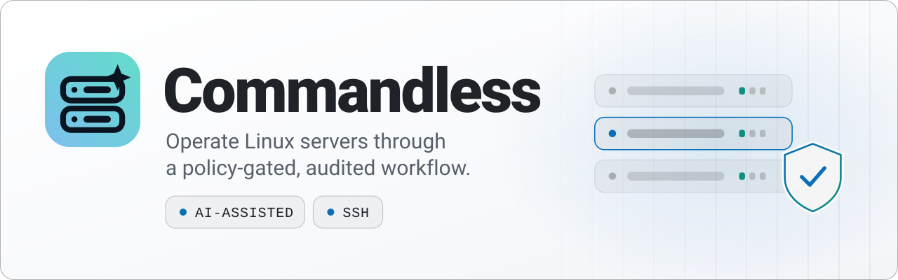

<picture>
  <source media="(prefers-color-scheme: dark)" srcset="assets/banner-dark.svg">
  <source media="(prefers-color-scheme: light)" srcset="assets/banner-light.svg">
  
</picture>

# Commandless

**AI-assisted server administration with controlled execution.**

By [Garda Studio](https://garda-studio.com).

[Product page](https://garda-studio.com/products/commandless) · [Releases](https://github.com/Garda-Studio/commandless-releases/releases) · [Feedback](https://github.com/Garda-Studio/commandless-releases/issues) · [Support](mailto:support@garda-studio.com)

## About

Commandless is an Electron desktop application for administering Linux servers through an AI-assisted workflow. Proposed operations are checked against the active mode and policy, with approvals and an audit trail.

## Highlights

- AI-assisted Linux server administration over SSH.
- Policy checks and approvals for proposed operations.
- An audit trail for reviewing operations.

<!-- Screenshots: add reviewed, real application captures here. Remove credentials and personal data before publishing. -->

## Downloads and installation

This is the public product and release hub. **Application source code is private.** Public downloads do not grant an open-source license; consult the license included with each release.

Installers and portable packages, when available, will be attached to Releases alongside installation instructions, changes, and known limitations. Do not use GitHub's automatically generated source archives as application installers.

## Feedback and security

For bugs, include the application version, operating system, and steps to reproduce. Remove credentials and private information from logs and screenshots.

Send sensitive reports to **support@garda-studio.com**, not public Issues.
